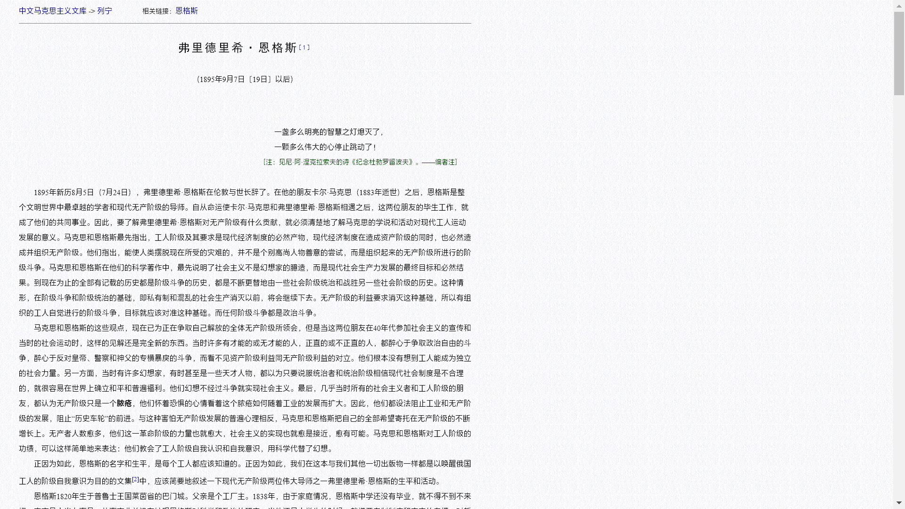
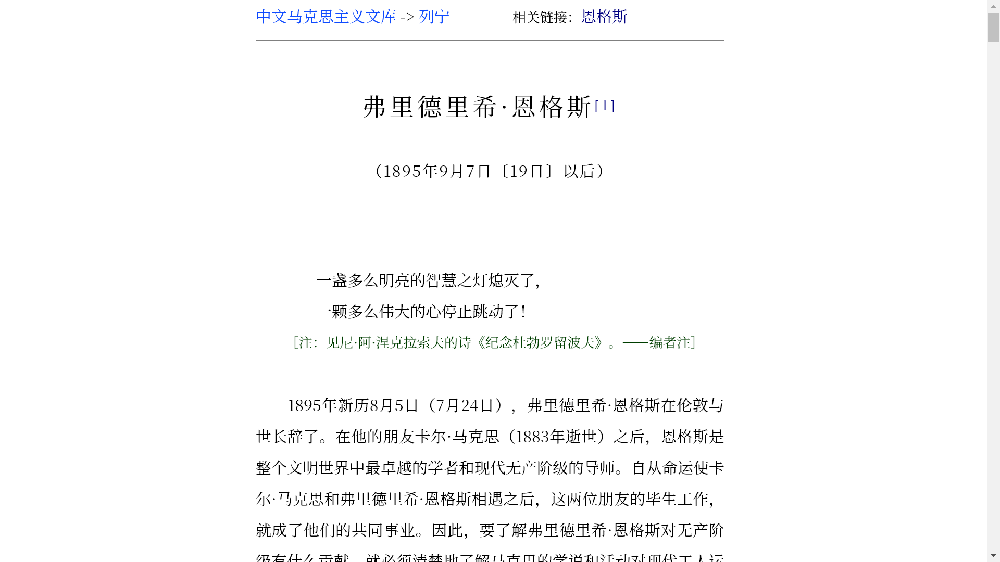

# 中马库优化教程

中文马克思主义文库（`www.marxists.org/chinese`）排版优化教程

## 快速链接

## 动机

如上图所示，中马库的文章排版较为密集，行宽较大，不易阅读。尽管通过「打印到 PDF」可以解决部分页面的行宽问题，但仍有一些页面由于采用 css 定义，无法直接解决。

为此，Marxism-Doc 编写了 `stylus` 脚本，以修复上述问题，并进行了删除背景、将正文改为衬线字体等其他优化。

预览效果如下：

## 使用方法

### 安装插件

请根据你使用的浏览器，进入对应的链接安装 Stylus 插件。

|浏览器|方法|
|:----:|:--:|
| **Chrome**  **Microsoft Edge** 等以 Chromium 为内核的浏览器|[Stylus - Chrome 应用商店](https://chrome.google.com/webstore/detail/stylus/clngdbkpkpeebahjckkjfobafhncgmne?hl=zh-CN)  如果无法访问，请进入 [Chrome 应用商店镜像站](https://crxdl.com/)，搜索 clngdbkpkpeebahjckkjfobafhncgmne 并下载最新版，并在 [扩展管理页面](chrome://extensions/)（`chrome://extensions/`）打开开发者选项，再将压缩包中的 .crx 文件拖入到该浏览器页面。|
| **Firefox**|[Stylus – 下载 🦊 Firefox 扩展](https://addons.mozilla.org/zh-CN/firefox/addon/styl-us/)|

### 添加 Stylus 规则

进入 [marxists-cn optimizer — UserStyles.world](https://userstyles.world/style/15422/marxists-cn-optimizer)，点击 **Install** 即可。

### 修改字体

进入 [字体设置](chrome://settings/fonts)（`chrome://settings/fonts`），将 **衬线字体** 修改为你喜欢的字体。Marxism-Doc 推荐：在（非高分屏）屏幕阅读时使用 **思源宋体** ，在生成打印 PDF 时使用 **方正书宋** 。
